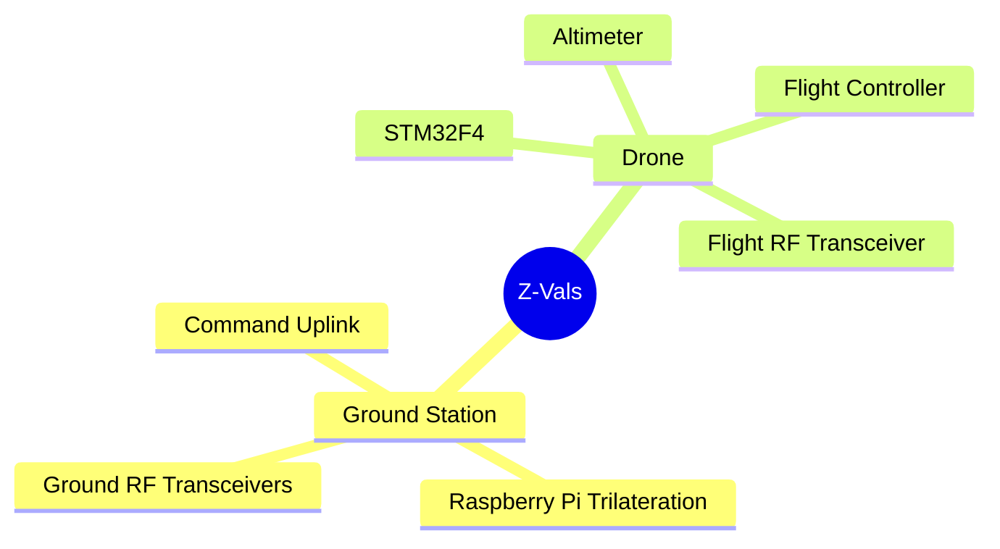
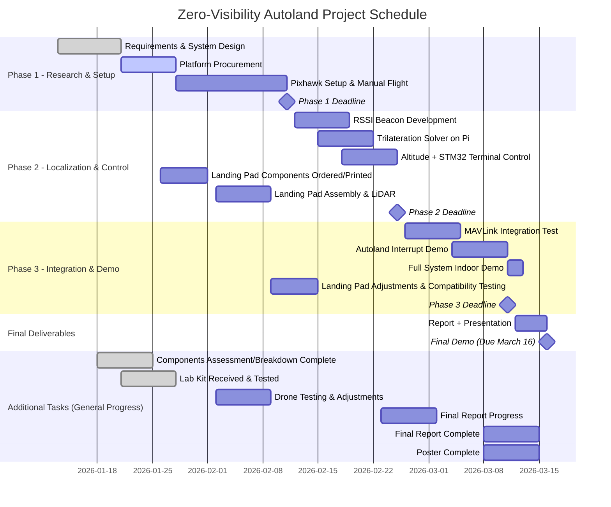

# ZVALS
## Zero-Visibility Autonomous Landing System
Autonomous landing landing system using an RF Ground Station and onboard Altimeter, without relying on vision or GPS, making it useful in situations where visibility is limited or nonexistent.
EE 475 Capstone
Group 10

## Authors
Asaf Iron-Jobes \- Sam Mansouri \- Reshmi Nilus   
Pranav Venugopalan \- Matt Calim \- Connor Klies

# Architecture

# **Product Relevance**

Many current drones rely on cameras and GPS to land accurately, which works well outdoors in clear conditions but fails in environments with smoke, fog, dust, low light, or indoor spaces where GPS is unavailable. This drone is designed to solve that problem by enabling autonomous landing without relying on vision or GPS, making it useful in situations where visibility is limited or nonexistent.  
This type of system is especially relevant for emergency response and industrial applications. Firefighters and search-and-rescue teams often operate in smoke-filled or visually obstructed environments where manually recovering a drone can be difficult or unsafe. Industrial settings such as warehouses, factories, and power plants are also GPS-denied and may have inconsistent lighting or airborne particles that reduce the effectiveness of camera-based systems. In these cases, a reliable non-visual landing method improves safety and usability.  
Comparable consumer drones typically utilize vision-based positioning or GPS-assisted return-to-home features, both of which perform poorly in indoor environments or under degraded visibility conditions. More advanced landing systems are used in military or aerospace applications, but these are expensive and impractical for small-scale UAVs. This project fills the gap by demonstrating a low-cost alternative that works in zero-visibility indoor environments.  
Primary use cases include indoor emergency response, industrial inspection and monitoring, autonomous indoor delivery or docking, and academic research in GPS-denied robotics. The project focuses specifically on landing rather than full navigation, which allows it to address a real and relevant problem in modern UAV operation.

# **Feasibility**

This project is feasible to complete within a 10-week quarter because it focuses on a specific and well-scoped problem: autonomous landing rather than full autonomous flight. The system is broken into clear components, including a ground-based guidance setup, onboard flight control, and a user-controlled transition from manual flight to autonomous landing. These parts can be developed and tested in parallel by different team members.  
The design relies on readily available hardware such as a Raspberry Pi, a microcontroller, RF modules, and a barometric altimeter, all of which are well-documented and commonly used in similar projects. Using an existing quadrotor platform and open-source flight control resources also reduces development time and risk.  
To stay within the time limit, the project prioritizes achieving a reliable autonomous touchdown in indoor, low-visibility conditions. Additional improvements such as increased landing precision or advanced filtering will only be attempted if the core system is working early. This approach ensures the project remains realistic while still meeting the technical expectations of a capstone design course.

# **Potential Risks**

 One large risk when designing aviation devices on a tight budget is that unexpected failures could lead to damaged hardware. Many of the parts in our drone could be fragile to a crash meaning if our drone crashes during a testing it could cost us a meaningful portion of our budget to replace or fix the parts. To mitigate this we should do test flights at low height and ideally above some sort of cushioned surface. 

	Ideally we will be able to use 3D printing to replace parts or prototype parts for testing to save the final version parts for later versions that are more stable. We have 2 group members with strong 3D printing and modeling skills so this expected additional workload should be manageable. 

As a plan C, we may need to use a base of a prebuilt drone hardware available for purchase and then add our software and sensor suite to control the automated landing protocol. If we decide to pivot to this approach we will need to revisit our specifications for our goal and project design to ensure it is still thorough enough to meet the level of challenge required for a capstone project. 

**Task Allocation**

	For task allocation, we have divided the project into six distinct tasks: (1) drone firmware with the STM32; (2) RF and protocol for communication between drone and ground station; (3) ground station software (Pi); (4) control systems for autoland and flight; (5) assembly and integration (i.e. assemble and mount sensors to the drone); (6) test and validation.  
	  
	These six components divide neatly into the six members of our team. With the assignments as follows: drone firmware with the STM32, Reshmi; RF and protocol for communication, Connor; ground station software, Asaf; control systems for autoland and flight, Sam; assembly of drone and integration of sensors and microcontrollers, Matt; test and validation, Pranav. These assignments are merely to designate who is responsible for managing each component. It is expected that team members ask for help if they need support on their task. 

# **Budget and Fundraising**

The budget for this project is a total of $300. This is funded by six University of Washington ECE students. This would go into building the drone, creating the landing station, and replacing any parts of the drone that could potentially be damaged in any trial runs. 

We decided that $300 is a reasonable budget by listing out the components (motors, propellers, batteries, etc.) and finding what can either be 3D printed, borrowed from the UW ECE store, or found online. By combing through reviews and comparing different prices from different vendors, we found that this was a reasonable budget. With a provided Raspberry Pi 4 board, cost was calculated for the RF modules, altimeter sensor, batteries, and battery chargers.

# **Schedule/Task Breakdown**

Week 1 (Jan 5-11):

- Group Selection  
- Project Brainstorming

Week 2 (Jan 12-18): 

- Project idea finalized  
- Proposal report and presentation complete  
- Components assessment/breakdown complete  
- Lab kit received and thoroughly tested

Week 3 (Jan 19-25): 

- Project presentation to class  
- Components of pieces ordered/printed/borrowed by ECE store  
- Drone assembly (can be rough, no testing yet)

Week 4 (Jan 26-Feb 1): 

- Phase 1 is complete  
- Drone testing & adjustments   
- Printing out/ ordering landing pad components

Week 5 (Feb 2-8): 

- Landing pad assembly & LiDAR 

Week 6 (Feb 9-15):

- Landing pad adjustments   
- Testing compatibility with drone and debugging, in low visibility conditions as well

Week 7(Feb 16-22): 

- Landing pad improvements   
- Any replacements or reordering for any damaged components should be ordered/printed

Week 8 (Feb 23- Mar 1): 

- Phase 2 is complete  
- Improvements/Troubleshooting on landing station and drone  
- Working on Final Project Report

Week 9 (Mar 2 \- 8): 

- Final Project Report complete   
- Final Project Poster complete

Week 10 (Mar 9 \- 15): 

- Phase 3 is complete  
- Working landing system using LiDAR complete

## Schedule Gantt

