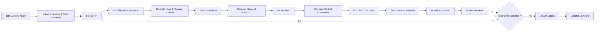

# ZVALS Control

## Key Files
- ``ZVALScontrol.prj``
  - Simulink project file

## Authors
Asaf Iron-Jobes and Sam Mansouri

## Architecture

```mermaid
flowchart LR
    A[Start Landing Mode] --> B[Initialize Sensors & State Estimator]

    B --> C[Perception]
    C --> C1[RF Trilateration / Altimeter]
    C1 --> C2[Estimate Pose & Relative Position]

    C2 --> D[State Estimation]

    D --> E[Generate Descent Trajectory]

    E --> F[Control Loop]
    F --> F1[Compute Control Commands]
    F1 --> F2[PID / MPC Controller]
    F2 --> F3[Send Motor Commands]

    F3 --> G[Actuation & Motion]
    G --> H[Monitor Descent]
    H --> I{Touchdown Detected?}

    I -->|No| C
    I -->|Yes| J[Disarm Motors]
    J --> K[Landing Complete]
```
