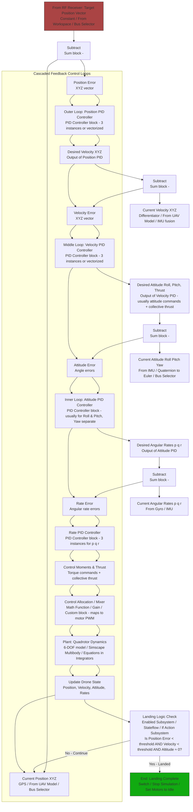

```mermaid
flowchart TD
    A[From RF Receiver: Target Position Vector\nConstant / From Workspace / Bus Selector] --> B[Subtract\nSum block -] 
    B --> C[Current Position XYZ\nGPS / From UAV Model / Bus Selector]
    B --> D[Position Error\nXYZ vector]
    D --> E[Outer Loop: Position PID Controller\nPID Controller block - 3 instances or vectorized]
    E --> F[Desired Velocity XYZ\nOutput of Position PID]
    F --> G[Subtract\nSum block -] 
    G --> H[Current Velocity XYZ\nDifferentiator / From UAV Model / IMU fusion]
    G --> I[Velocity Error\nXYZ vector]
    I --> J[Middle Loop: Velocity PID Controller\nPID Controller block - 3 instances or vectorized]
    J --> K[Desired Attitude Roll, Pitch, Thrust\nOutput of Velocity PID - usually attitude commands + collective thrust]
    K --> L[Subtract\nSum block -] 
    L --> M[Current Attitude Roll Pitch Yaw\nFrom IMU / Quaternion to Euler / Bus Selector]
    L --> N[Attitude Error\nAngle errors]
    N --> O[Inner Loop: Attitude PID Controller\nPID Controller block - usually for Roll & Pitch, Yaw separate]
    O --> P[Desired Angular Rates p q r\nOutput of Attitude PID]
    P --> Q[Subtract\nSum block -] 
    Q --> R[Current Angular Rates p q r\nFrom Gyro / IMU]
    Q --> S[Rate Error\nAngular rate errors]
    S --> T[Rate PID Controller\nPID Controller block - 3 instances for p q r]
    T --> U[Control Moments & Thrust\nTorque commands + collective thrust]
    U --> V[Control Allocation / Mixer\nMath Function / Gain / Custom block - maps to motor PWM]
    V --> W[Plant: Quadrotor Dynamics\n6-DOF model / Simscape Multibody / Equations in Integrators]
    W --> X[Update Drone State\nPosition, Velocity, Attitude, Rates]
    X --> Y[Landing Logic Check\nEnabled Subsystem / Stateflow / If Action Subsystem\nIs Position Error < threshold AND Velocity < threshold AND Altitude ≈ 0?]
    Y -->|No - Continue| C
    Y -->|Yes - Landed| Z[End: Landing Complete\nSwitch / Stop Simulation / Set Motors to Idle]

    subgraph "Cascaded Feedback Control Loops"
        D --> E --> F --> I --> J --> N --> O --> S --> T --> U --> V --> W --> X --> C
    end

    style A fill:#a44,stroke:#333
    style Z fill:#1a1,stroke:#333
```