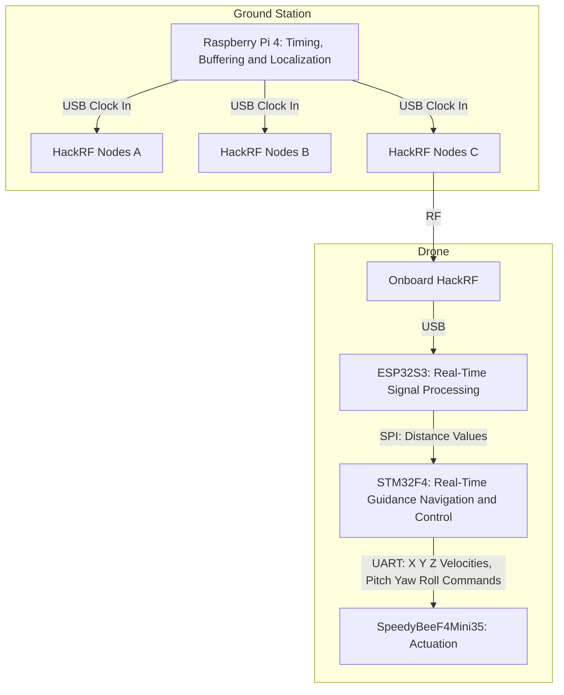

```mermaid
 flowchart TD
    subgraph Ground Station
    A[HackRF Nodes A]
    B[HackRF Nodes B]
    C[HackRF Nodes C]
    D[Raspberry Pi 4: Timing, Buffering and Localization] -->|USB Clock In| C
    D -->|USB Clock In| B
    D -->|USB Clock In| A
    end
    subgraph Drone
    C -->|RF| S[Onboard HackRF]
    S-->|USB| K[ESP32S3: Real-Time Signal Processing]
    K -->|SPI: Distance Values| E[STM32F4: Real-Time Guidance Navigation and Control]
    E -->|UART: X Y Z Velocities, Pitch Yaw Roll Commands| F[SpeedyBeeF4Mini35: Actuation]
    end
```