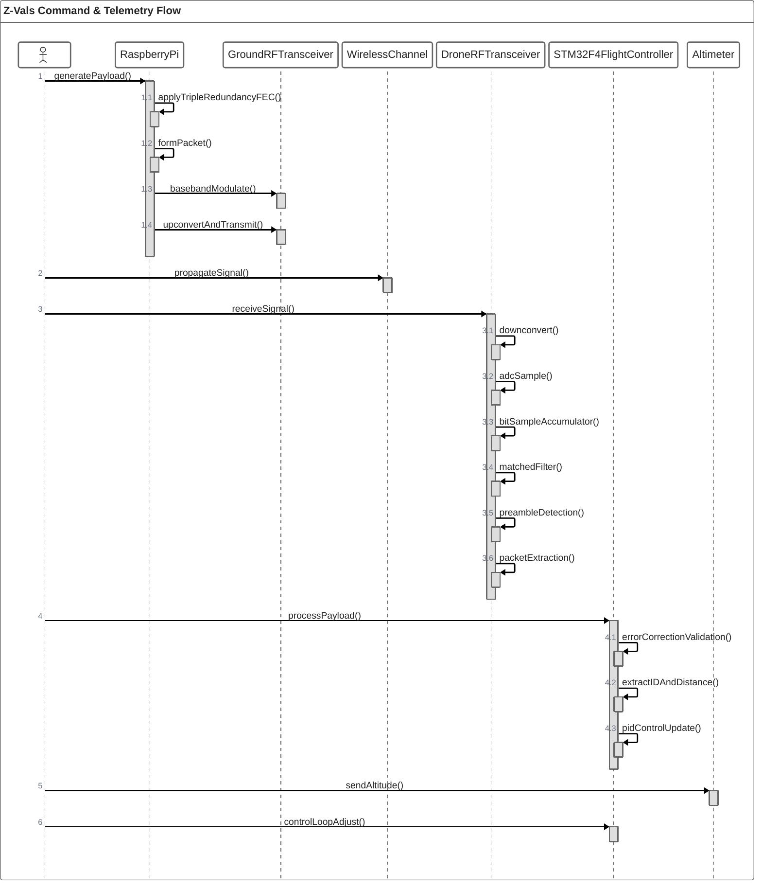

```mermaid
zenuml
title Z-Vals Command & Telemetry Flow

RaspberryPi.generatePayload() {
  RaspberryPi.applyTripleRedundancyFEC()
  RaspberryPi.formPacket()
  GroundRFTransceiver.basebandModulate()
  GroundRFTransceiver.upconvertAndTransmit()
}

WirelessChannel.propagateSignal()

DroneRFTransceiver.receiveSignal() {
  DroneRFTransceiver.downconvert()
  DroneRFTransceiver.adcSample()
  DroneRFTransceiver.bitSampleAccumulator()
  DroneRFTransceiver.matchedFilter()
  DroneRFTransceiver.preambleDetection()
  DroneRFTransceiver.packetExtraction()
}

STM32F4FlightController.processPayload() {
  STM32F4FlightController.errorCorrectionValidation()
  STM32F4FlightController.extractIDAndDistance()
  STM32F4FlightController.pidControlUpdate()
}

Altimeter.sendAltitude()
STM32F4FlightController.controlLoopAdjust()
```